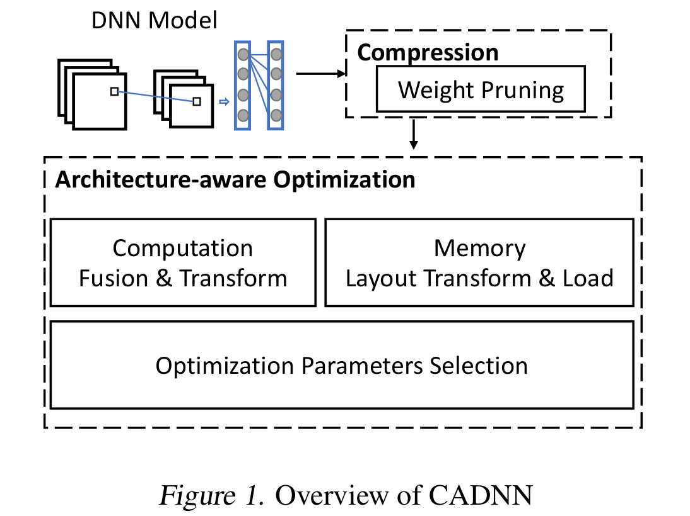

### 标题《26ms Inference Time for ResNet-50: Towards Real-Time Execution of all DNNs on Smartphone》

### 摘要
        随着高端手机的不断涌现，很多原来需要PC级运算能力的应用，现在也能很easy的运行在手机上。但是如果没有经过仔细的优化，深度神经网络跑起来也是比较费劲的。本文介绍下CADNN，一个高效的框架，应用了高级模型压缩（稀疏化）和整体的优化，实验表明CADNN表现要优于Tensorflow Lite和TVM。

### 引言
        近来，自动驾驶和增强现实技术越来越流行，他们都被近几年实时连续的视频流处理的巨大进步加速了应用。深度神经网络，卷积神经网络和循环神经网络是高质量实时连续视频流处理的基础。因为对于计算性能和存储的高需求，在现在的手机上实时运行深度神经网络依然是一个比较难的挑战。
        在这个领域，前人已经有很多有用的工作，如DeepMon、DeepX、DeepSense、MCDNN、TVM、Tensorflow Lite等。但是他们之中很少有关注模型压缩（减少权值，权值量化）可能带来的运算和存储优化。所以手机设备上的深度神经网络模型还有非常可观的优化空间。
        模型压缩主要有两个方面的障碍，一是模型压缩通常会降低推断阶段的准确率，一是压缩的模型会变得不规律，导致数据局部化和负载不均衡等问题，加大了优化难度。
        本文提出的CADNN，能够高效地运行在手机设备上；有更高级的模型压缩方法能够在最小化准确率损失的同时提高模型的压缩率；架构级别优化使得模型压缩带来的不规则化的影响降到最小。据作者所知，在手机上的表现，CADNN比目前市面上的DNN框架都要优秀。在Inception-V3、MobileNet和Resnet50几个模型的测试中，CADNN要比Tensorflow Lite和TVM分别快到8.8倍和6.4倍。
        我们的主要贡献如下：
        1. CADNN采用的高级模型压缩方法，能够获得最高的模型压缩率。
        2. CADNN仔细研究了模型压缩带来的性能问题，并提出了一系列的架构级别的优化方法，如运算模式转换（computation pattern transformation）、消除多余的内存负载（redundant memory load elimination）、内存和计算参数智能选择（samrt selection of memory and computation optimization parameters）等。
        3. CADNN评估了现代手机上的CPUs和GPUs之间的性能差异
        

### 概述
        CADNN主要有两个阶段，模型压缩（消除权值）和模型架构优化。架构优化由3个部分组成：模型运算融合和转换，内存结构转换和加载优化，优化参数选择。

### 统一深度神经模型压缩框架ADMM
        最近提出了系统级的DNN权值消除技术，使用了高级变量分裂优化方法ADMM（Alternating Direction Methods of Multipliers).ADMM通过分解原始问题为两个独立子问题，是一个强大的优化工具。

假设优化问题：$min_xf(x)+g(x)$

引入辅助变量z，原来的问题分解成，$q_1$和$q_2$为二次方程：
$$
\begin{cases}
min_xf(x)+q_1(x|z) \\
min_zg(z)+q_2(z|x)
\end{cases}
$$
在权值消除问题中，$f(x)$就是DNN的loss方程，第一个子问题就是把loss方程加上二次正则训练DNN。$g(x)$就是权值消除的联合约束，在ADMM中通过欧几里得投影可求得最优的解析解。

基于ADMM的方法取得了优秀的权值消除结果，但是他的方法可用性缺乏算法层面的保证，例如所有的约束都需要满足。在ADMM的基础上我们做了3点扩展。1.集成ADMM正则、掩码和重训练。2.使用ADMM统一权值消除和权值量化。3.开发了multi-$\rho$等技术加速收敛和提高解的质量。在模型压缩上，我们比其他方法要提高了两个数量级。

### 模型结构优化
        针对手机端的三个主要优化点如下：
        1.模型运算融合和转换，权值消除后每一层运算量显著减少，但是内存访问变得不规则，这样容易放大内存墙的影响。CADNN因此寻找每一个可以融合多个操作为一个操作的可能，提高内存效率，打包很多运算还可以提高SIMD的利用率。特别的，我们会将1x1的卷积操作转换成矩阵乘法运算。
        2.内存结构变换和数据加载优化，为了进一步提高数据的本地化，CADNN还通过变换数据的存储结构来适应CPU和GPU。例如分块、排列顺序和补齐等。
        3.优化参数选择，例如分块的带向，unroll的大小，运算顺序等。