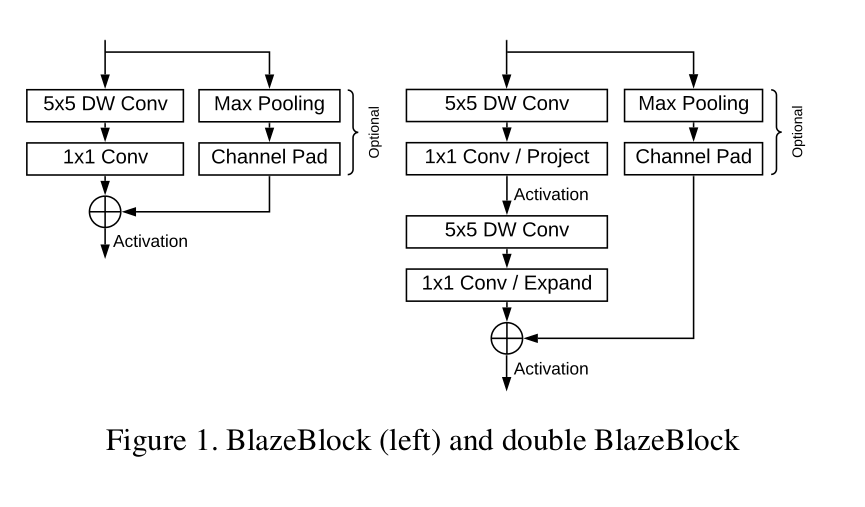

### 标题 BlazeFace: Sub-millisecond Neural Face Detection on Mobile GPUs

### 摘要：
        BlazeFace，一个轻量级高性能的，针对移动端GPU深度优化的人脸检测模型，在旗舰机型的手机上运行200-1000+帧。主要工作包括优化后的Mobileet特征提取后端，一个GPU适用的SSD-anchor算法，和用来替代非极大抑制算法的提升tie-resolution策略。

### 引言：
        物体检测一般处于视频处理流的第一步，在其后再根据不同的任务后接分割、跟踪，和几何变换。所以检测的效率要求需要超过实时级别。
        本文提出了一个新的检测模型BlazeFace，基于手机GPUs优化的SSD（Single Shot Multibox Detector)。提出了以下改进：
        1. 精简的特征提取CNN (速度相关)
        2. GPU-friendly anchor算法 （速度相关）
        3. 重叠的Priors使用tie-reolution平滑代替nms （精度相关）

### Face detection
        前后摄像头的焦距和典型的物体大小不同，所以训练了两个模型，并且在最后还预测了6个关键点用于预测矩形框的旋转和形变。

### 结构设计

#### 增大感受野
        depthwise-separable convolution的主要运算量集中在1x1的separable部分。假设，输入特征是sxsxc，输出特征是sxsxd，depthwise部分运算量sxsxcxkxk，sparable部分运算量sxsxcxd。
        所以增加kernel大小的代价较小。在保持感受野大小不变的情况下，使用了大的kernel，就可以减少总体的bottleneck的数量。

#### Feature extractor
        前摄像头的物体的Scale比较大，采用128x128的RGB图像作为输入，然后经过一个conv，5个Single-BlazeBlock，6个double BlazeBlock。

#### 锚框算法
        SSD-like检测模型基于预先定义的，固定大小的bounding boxes，称作priors。一系列的回归参数对应每一个prior的中心偏移和大小缩放。
        不同分辨率的特征图对应到不同的物体大小和不同的priors，典型的SSD模型使用1x1, 2x2, 4x4, 8x8, 16x16几个分辨率的特征图，特征图需要一直下采样到1x1的分辨率，但是如果只是用到合适的特征图分辨率，可以大量减少运算量。把原来8x8, 4x4, 2x2分辨率特征图上每个点2个scale的priors，变成了6个8x8分辨率上的priors，而aspect在人脸检测的应用只使用1：1即可。

#### 后处理操作
        因为在8x8的分辨率特征图之后没有继续下采样，所以一个对象上重叠的priors会显著增加，传统的nms算法只是取一个最优的bbox作为最后的输出。这样在视频处理流中，容易出现预测框的抖动现象。
        为了减小抖动的现象，我们提出了使用加权平均的策略来替代原来的nms。