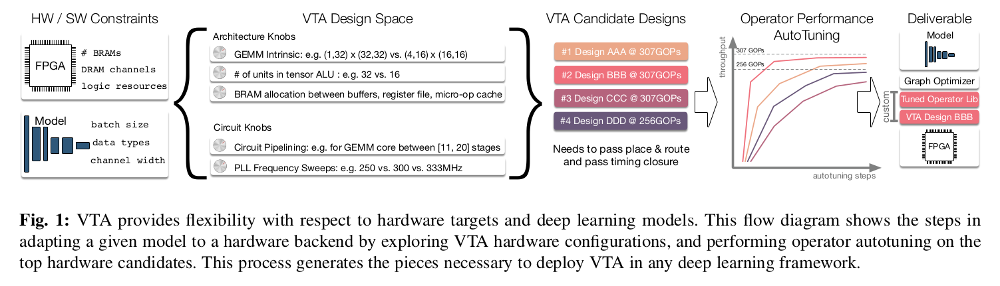
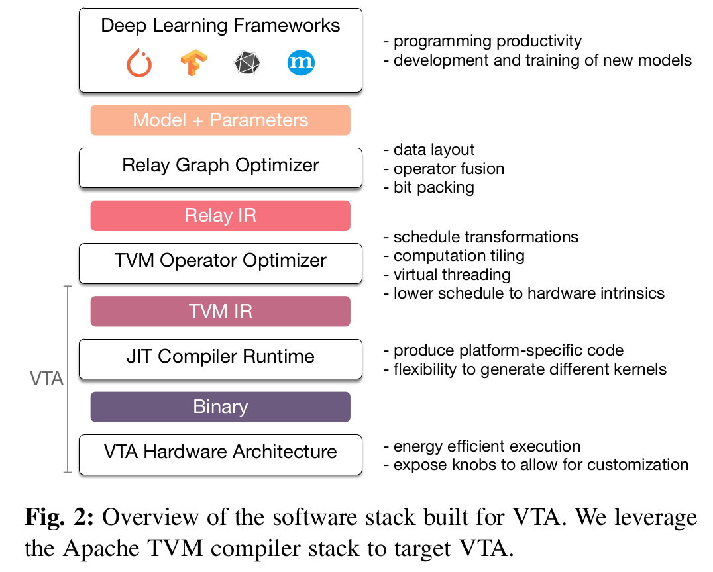
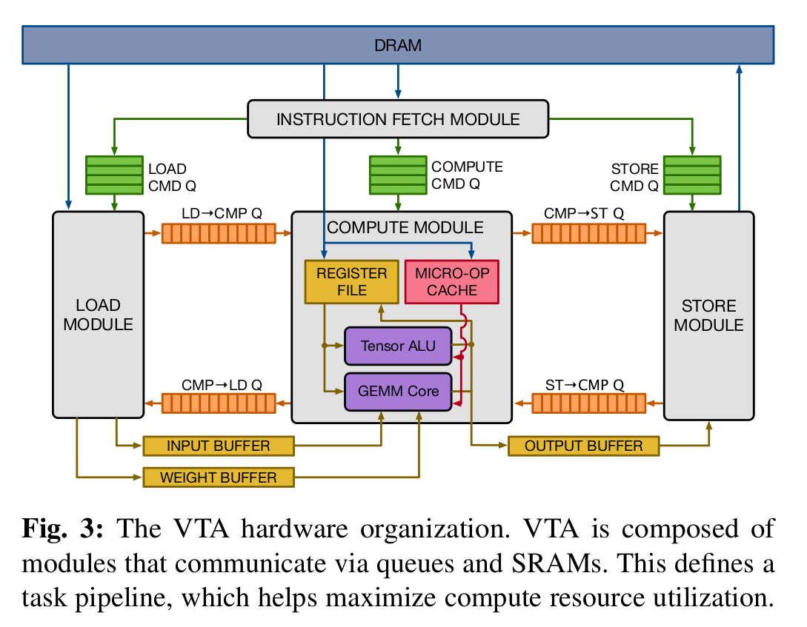

### 标题:
[《A Hardware-Software Blueprint for Flexible Deep Learning Specialization》](papers/blueprint.pdf)
### 摘要：
&emsp;&emsp;专用的深度学习加速器在提供高性能的同时，牺牲了其便利性。面对日益增长的工作量，我们提出了VTA，一个可扩展设计的可编程的深度学习结构模型。VTA非常适合可编程的结构，其中包括两级ISA（Instructioin Set Architecture），和JIT（just-in-time）编译。两级ISA，其中任务ISA负责组织并行运算和内存，微编码ISA负责实现一系列的张量操作。我们使用了即时编译器用来灵活地生成代码和异构执行的运行时系统。

&emsp;&emsp;VTA被集成在开源的TVM中，TVM是一个优秀的深度学习编译器堆栈，能够适用多种模型和硬件终端。我们提供了生成定制化的硬件结构和软件操作库的一套流程，并演示了在FPGA上部署物体分类和风格迁移的示例。
### 引言：
&emsp;&emsp;VTA（Versatile Tensor Accelerator)的主要贡献有：

1. 两级编程接口：高级ISA用于任务调度，低级的ISA提供软件定义的操作，在VTA中所有东西都是参数化的。包括硬件指令，内存，数据类型等。
2. 一个运行时的即时编译系统，能够在运行时扩展微编码运行核。
3. 一个自动调优平台，可以优化数据读写和复用。

### VTA硬件和软件栈

1. 深度学习框架，设计和训练深度学习模型
2. Relay图优化器
3. TVM运算优化器。分片->并行化->运算分解成高级硬件指令
4. JIT编译器和运行时
5. 硬件结构，GEMM核，SRAM形状，数据类型宽度
### VTA架构和JIT编译器

&emsp;&emsp;VTA由四个模块构成：fetch，load，compute和store，四个模块组成一个task pipeline（任务流水线）。这些模块通过指令队列和片上共享内存（SRAMs)通信。内存访问通过特殊的指令队列进行同步，防止framwork和Software。于是，选择了3阶段指令结构（load-compute-store）。
