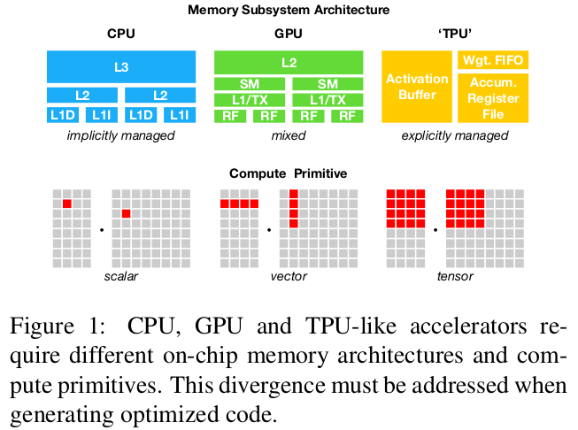

### 标题： TVM: An Automated End-to-End Optimizing Compiler for Deep Learning

### 摘要：
      TVM提供了图结构层面和操作层面的优化，使得深度模型能够在运行在多种设备终端（GPUs， mobile-phone, embedded devices, accelerators(FPGAs, ASICs))。
      TVM不仅解决了高层次的优化难题，例如操作融合，不同硬件原语映射和内存透明机制；而且通过使用基于学习的模型化方法快速进行代码优化。
      实验表明TVM在低功耗CPU，移动CPU和GPUs上的性能表现是非常优异的（competitive with state-of-art, hand-tuned libraries)。
      TVM还提供了基于FPGA的通用深度学习加速器，TVM系统是开源的，而且已经被一些主要公司在多个产品上应用。

### 引言：

        深度学习模型能够识别图像，处理自然语言和在挑战策略游戏中打败人类，在各种设备中部署智能应用的需求也在不断增长。由于硬件设备的特性不同，所以部署的过程会比较复杂。如下图所示。

       当前的深度学习框架，例如Tensorflow，MXNet，Caffe和Pytorch，都是基于计算图的中间表示去实现优化的，例如自动求导和动态内存管理。图层次的优化通常不能很好的解决设备差异的问题，大多数情况下的做法都是聚焦在一类GPU设备上，针对设备供应商的提供的高层次操作库的优化，这些操作库的优化需要手工调试，并且很难移植到其他的设备上。
       如果要支持不同的设备后端，框架开发者将会面临一个两难的选择。要么避免图优化，使用新操作库中优化操作，要么放弃新操作库中的优化操作，而使用未经优化的实现。
       我们创建的TVM，能够从现有的框架中获得高层次的模型描述，而针对不同设备后端生成操作层面的低层次的优化代码。他是一个端到端的，完全不同的实现。
       为了能够吸引用户，TVM必须提供在不同设备上和手工优化的操作库相当的性能表现。而实现这个目标主要有一下两点挑战。

       1. 生成指定操作的代码描述时按照硬件特性详细还是尽量抽象的平衡。
       2. 内存访问方式，线程模式和不同的硬件指令等不同选择组合起来，使得操作的表示空间变得很大，获得最优解的难度大。

       为了解决上述难题，TVM设计了3个关键模块。
       1. tensor expresion language 创建Operator，根据不同的优化场景生成不同版本。这个layer扩展了Halided。
       2. automated program optimization framwork.ML-based cost model。
       3. graph rewriter。

       本文主要的贡献有：我们指出了在多种设备上部署深度学习模型的主要挑战，提出了流程原语（schedule primitives），实现了基于机器学习的自动搜索优化空间的模型，创建了一个端到端的编译和优化栈，能够将Tensorflow， MXNet， Pytorch， Keras， CNTK部署到各种硬件设备中。和手工优化库相比，TVM能够获得1.2x到3.8x的加速比。

### 概述：

    

