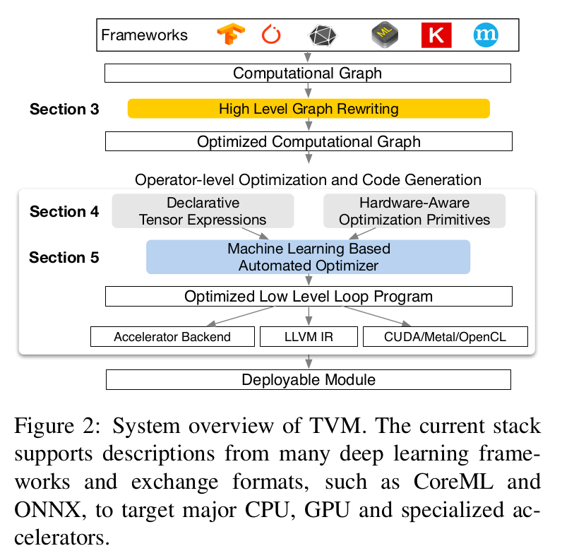
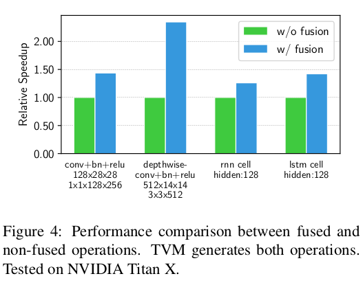
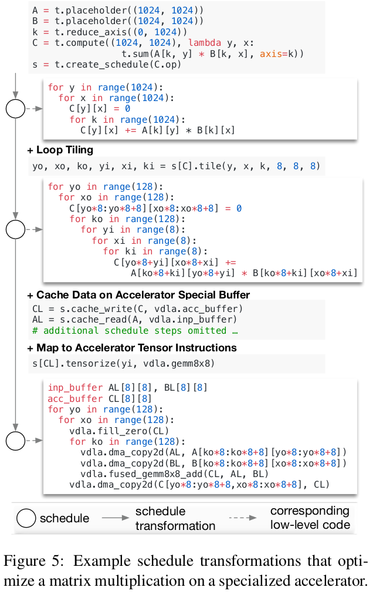
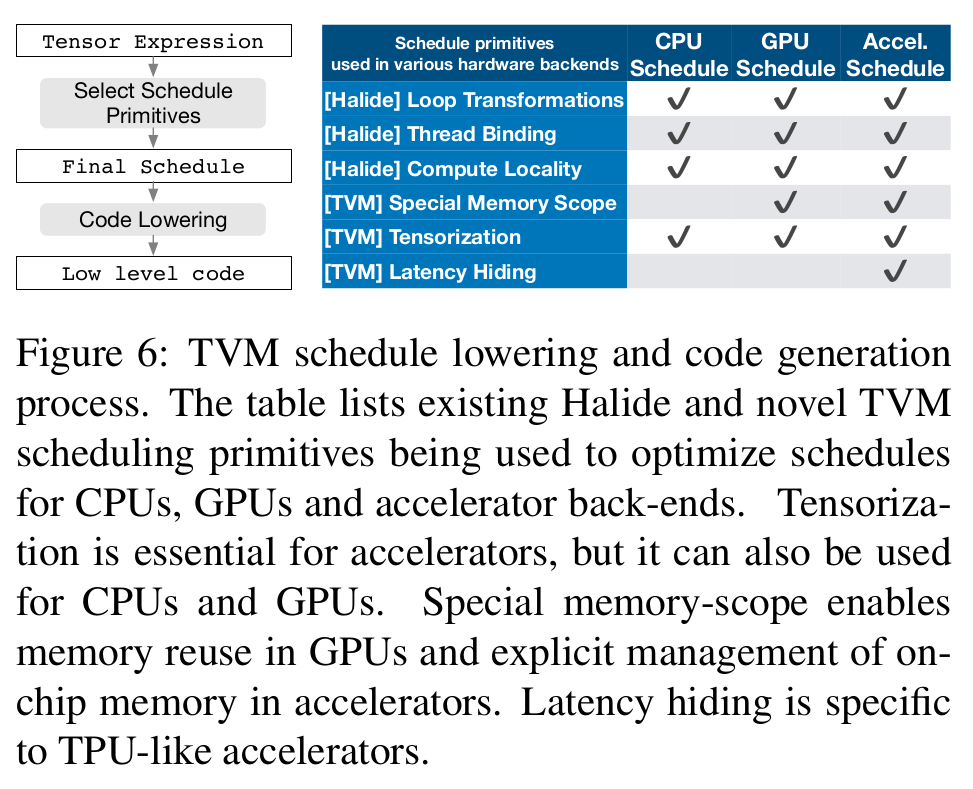
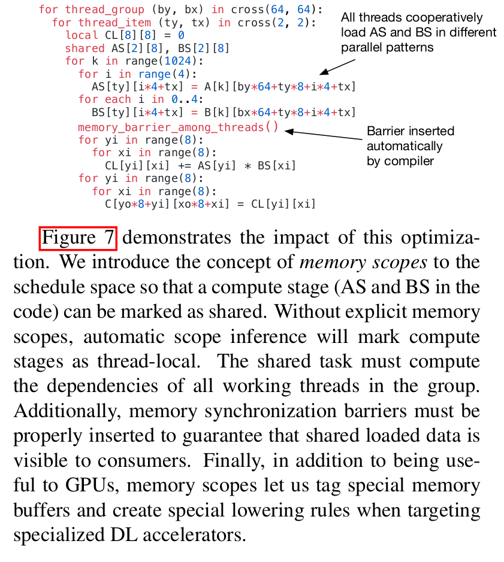

### 标题： TVM: An Automated End-to-End Optimizing Compiler for Deep Learning

### 摘要：
      TVM提供了图结构层面和操作层面的优化，使得深度模型能够在运行在多种设备终端（GPUs， mobile-phone, embedded devices, accelerators(FPGAs, ASICs))。
      TVM不仅解决了高层次的优化难题，例如操作融合，不同硬件原语映射和内存透明机制；而且通过使用基于学习的模型化方法快速进行代码优化。
      实验表明TVM在低功耗CPU，移动CPU和GPUs上的性能表现是非常优异的（competitive with state-of-art, hand-tuned libraries)。
      TVM还提供了基于FPGA的通用深度学习加速器，TVM系统是开源的，而且已经被一些主要公司在多个产品上应用。

### 引言：

        深度学习模型能够识别图像，处理自然语言和在挑战策略游戏中打败人类，在各种设备中部署智能应用的需求也在不断增长。由于硬件设备的特性不同，所以部署的过程会比较复杂。如下图所示。


       当前的深度学习框架，例如Tensorflow，MXNet，Caffe和Pytorch，都是基于计算图的中间表示去实现优化的，例如自动求导和动态内存管理。图层次的优化通常不能很好的解决设备差异的问题，大多数情况下的做法都是聚焦在一类GPU设备上，针对设备供应商的提供的高层次操作库的优化，这些操作库的优化需要手工调试，并且很难移植到其他的设备上。
       如果要支持不同的设备后端，框架开发者将会面临一个两难的选择。要么避免图优化，使用新操作库中优化操作，要么放弃新操作库中的优化操作，而使用未经优化的实现。
       我们创建的TVM，能够从现有的框架中获得高层次的模型描述，而针对不同设备后端生成操作层面的低层次的优化代码。他是一个端到端的，完全不同的实现。
       为了能够吸引用户，TVM必须提供在不同设备上和手工优化的操作库相当的性能表现。而实现这个目标主要有一下两点挑战。

       1. 生成指定操作的代码描述时按照硬件特性详细还是尽量抽象的平衡。
       2. 内存访问方式，线程模式和不同的硬件指令等不同选择组合起来，使得操作的表示空间变得很大，获得最优解的难度大。

       为了解决上述难题，TVM设计了3个关键模块。
       1. tensor expresion language 创建Operator，根据不同的优化场景生成不同版本。这个layer扩展了Halided。
       2. automated program optimization framwork.ML-based cost model。
       3. graph rewriter。

       本文主要的贡献有：我们指出了在多种设备上部署深度学习模型的主要挑战，提出了流程原语（schedule primitives），实现了基于机器学习的自动搜索优化空间的模型，创建了一个端到端的编译和优化栈，能够将Tensorflow， MXNet， Pytorch， Keras， CNTK部署到各种硬件设备中。和手工优化库相比，TVM能够获得1.2x到3.8x的加速比。

### 概述：
    TVM的工作流程如下：
       1. 读取框架的模型作为输入，翻译成计算图表示结构；
       2. 高层次图结构上的数据流重写，生成优化图；
       3. 低层次操作模块实现代码优化，使用tensor表达式结构，忽略硬件层次的细节；
       4. 在给定硬件平台上搜索最优底层实现，并综合这些代码生成部署模块。



``` python
import tvm as t

graph, params = t.frontend.from_keras(keras_model)
tartget = t.target().cuda()
graph, lib, params = t.compiler.build(graph, target, params)

import tvm.runtime as runtime

module = runtime.create(graph, lib, runtime.cuda(0))
module.set_input(**params)
module.run(data=data_array)
output = tvm.nd.empty(out_shape, ctx=runtime.cuda())
module.get_output(0, output)

```

### Section3: 计算图优化
       计算图表示，节点代表操作（操作对象是张量和输入），边代表节点间的依赖。图层次的优化主要有：操作融合（operator fusion），常量折叠(constant-folding,静态数据操作在编译阶段完成计算，减少节点数量)。同时数据的维度排列顺序也可以调整成设备端最优支持的结构。

#### 操作融合（Operator Fusion）
    计算图操作可以分成四类：（1）单射结构element-wise，例如add（2）缩减模式Reduction，例如sum（3）复杂的融合结构fuse element-wise，例如conv2d（4）模糊模式opaque，例如sort。
    1. 多个单射结构可以融合成一个单射结构的操作；
    2. 缩减模式的操作可以和单射结构的操作融合（例如，scale和sum）；
    3. conv2d可以融合输出侧的element-wise操作


#### 数据结构变换(Data Layout Transformation)
       数据结构除了row-major, column-major这种基本结构以外，还需要考虑设备端更复杂的情况，例如某个加速器实现了4x4的矩阵基本运算，那么如果数据按照4x4的分块存储的话，将获得最佳性能。

       
       数据结构优化，根据目标硬件将计算图的数据结构转换成能够更好使用内部数据的结构。如果生产者保存的数据存储结构和使用者需要的数据存储结构不同，则转换该数据。
       高层次的运算图优化能够达到操作库提供的最佳性能，当前一些深度学习库支持的操作融合主要由库中支持的融合模式决定。随着基础操作的增加，可能融合的操作也越来越多，而且不同的设备和后端又引申出数据存储结构，数据类型和加速器指令等差异，原来那种手工融合模式的方式变得不再适用。我们提出了一个代码生成器的结构来为指定的模型操作生成各种可能的实现。

### 生成张量操作
       我们使用Halide的把操作描述和运算规则（运算流程优化）解耦，同时扩展Halide，使其能够支持一些新的优化（嵌套循环，张量化和延迟计算隐藏）等。

#### 张量表示和流程空间
       张量操作由一系列顺序的运算公式表示。举例，下面表示转置矩阵乘法:
```python
m, n, h = t.var('m'), t.var('n'), t.var('h')
A = t.placeholder((m, h), name='A')
B = t.placeholder((n, h), name='B')
k = t.reduce_axis((0, h), name='k')
C = t.compute((m, n), lambda y, x: t.sum(A[k, y] * B[k, x], axis=k))
```
       每一个运算描述指定了输出张量的形状和每一个元素的运算过程。这种描述方法没有定义循环结构和其他的执行细节，为硬件优化提供了便利，解耦了运算和流程。
       TVM使用一个数据结构来跟踪循环结构和流程转换的信息，这些信息可以帮助生成低层次的代码。
       张量表示从Halide, Darkroom, TACO中获得灵感， 他们能够支持TVM的schedule优化，我们提供了足够多的schedule原语用于支持不同的后端。当使用GPU和加速器时，我们使用不同于Halide的低层次的循环描述AST，而引入了新的schedule原语。CPU，GPU和类TPU的加速器是3中主要的硬件类型。


#### 合作的嵌套并行化
       GPU上需要我们将schedule转换成并行模式，多数现存的解决方案都采用一个叫做嵌套并行的模型，一个分支再合并的结构。这种模型可能具有多个并行化的层次，每一个线程只能看到自己线程的数据，彼此独立。
       和不共享数据的实现不同，还有一种合作来得到数据的方案，一组数据一起获得他们需要的数据放在共享内存中，这种优化能够最大限度的利用GPU的内存架构，而且能够实现数据复用。


