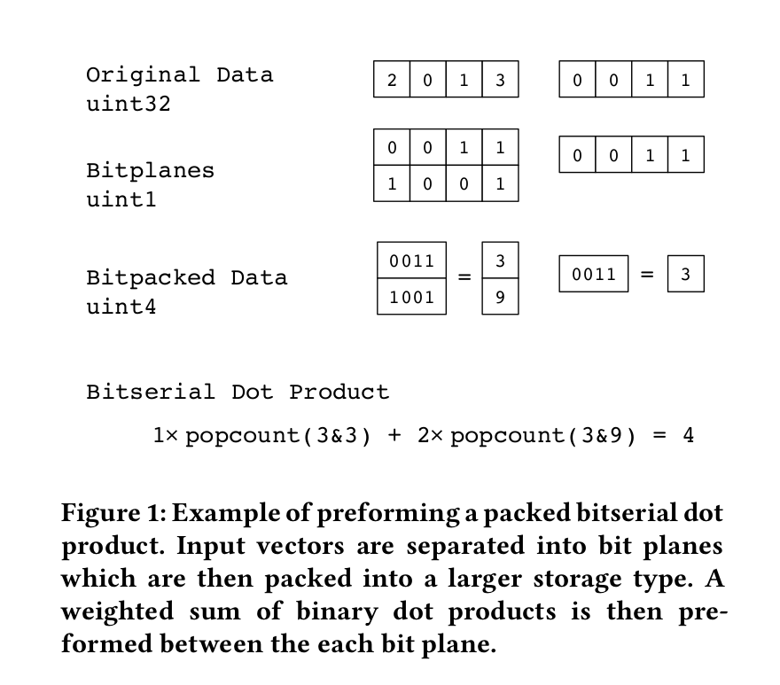
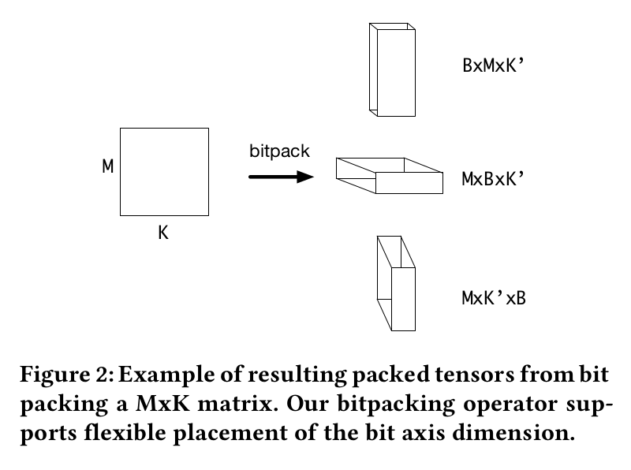
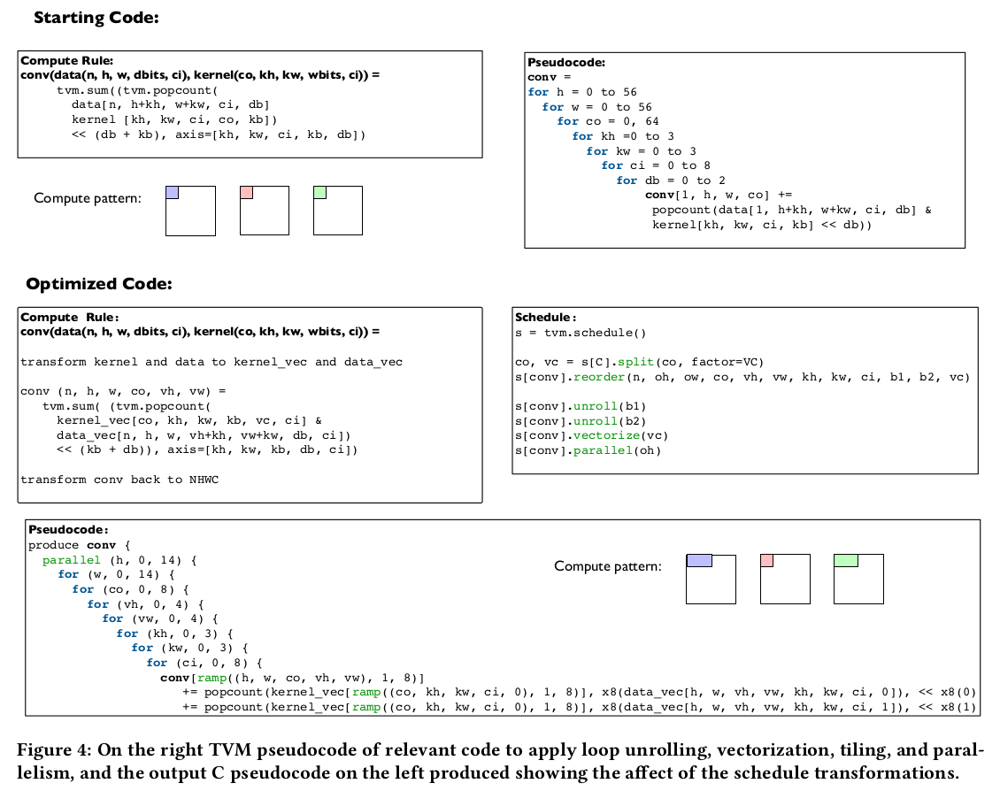
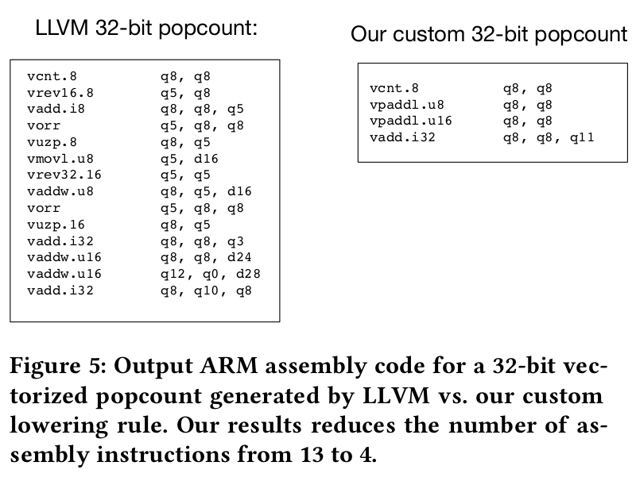
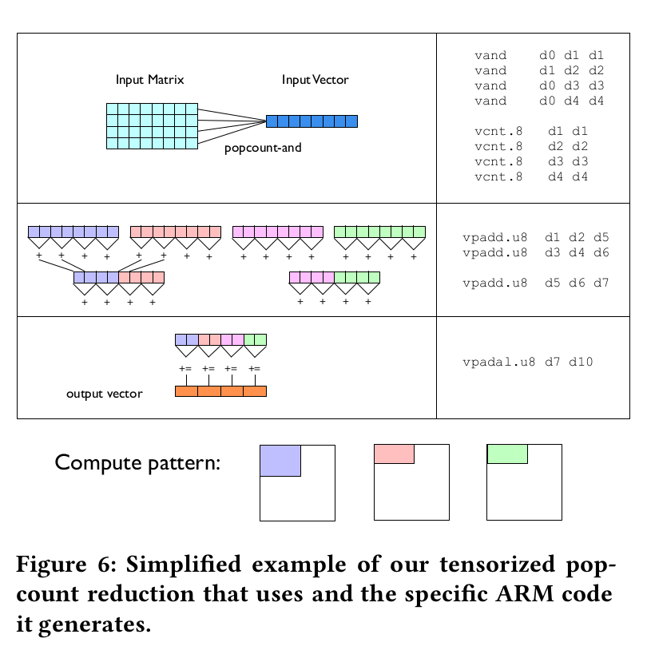

### 标题： 《Automating Generation of Low Precision Deep Learning Operators》

### 摘要：
&emsp;&emsp;作者在ARM Cortex-A53 CPU上生成了1-bit，2-bit卷积操作，和16-bit的整数基线相比快了16倍，比手写的实现快了2.3倍

### 引言：
&emsp;&emsp;低精度运算除了需要模型支持，还需要优化的Operator实现，才能达到接近理论的效果。作者介绍了一种快速生成高性能的低精度深度学习operator的方法，可以针对不同的CPU采用不同的精度，同时包括了内存分片和向量化优化。文章的主要贡献有：1.量化运算库，包括bit packing, matrix multiply和convolution；2.在树莓派上的研究实例。

### 背景和相关工作：
#### 2.1 低精度神经网络
&emsp;&emsp;BNNs在简单数据集上表现很好，但是在复杂数据集上精度损失比较厉害，XNORNet和ResNet18相比，在ImageNet数据集上准确度下降超过18%。为了解决精度下降的问题，最近的研究在保持权值二值化的同时，开始将激活值扩展到多个bit。HWGQ使用了1-bit的权值和2-bit的激活值，准确度下降5%-9%左右。

#### 2.2 位序列计算
$$
x*y = popcount(x \& y) \\
x*y = \sum_{n=0}^{N-1}\sum_{m=0}^{M-1}popcount(x_n \& y_m) * 2^{m+n}
$$

### 3. 低精度操作
#### 3.1 量化和打包
维度增加一维$d \rightarrow (d+1)$

reduction axis bitpack$k \rightarrow k'$

#### 3.2 高层次优化
使用TVM来表示operator，并利用TVM生成优化的编译代码
TVM auto-tuning capabilities to search for optimal parameter configurations

### 3.3 架构（CPU）级别优化
TVM使用LLVM生成CPU-backend的代码（编译，汇编），但是LLVM生成的代码在微观的层面是次优的，不能最大化的利用不同CPU的优化特性（pair add和vcnt等），需要highly optimized hand-generated microkernel

### 4.CPU-AGNOSTIC SCHEDULE（rely on TVM）
HPC（high performance computing techniques)手段：
- memory locality
- parallelism
- vectorization

Tiling：split和reorder
Unrolling
Vectorization：SIMD instructions
Parallellization: outer most axis of computation

### 5.ARM CORTEX-A53上的CONVOLUTION SCHEDULE
#### 5.1 popcount的两种实现

#### 5.2 bitserial matrix vector multiply microkernel
1.relay on tiling
2.accumulation in small datatype
3.most optimizations occur between a small localized region of code

